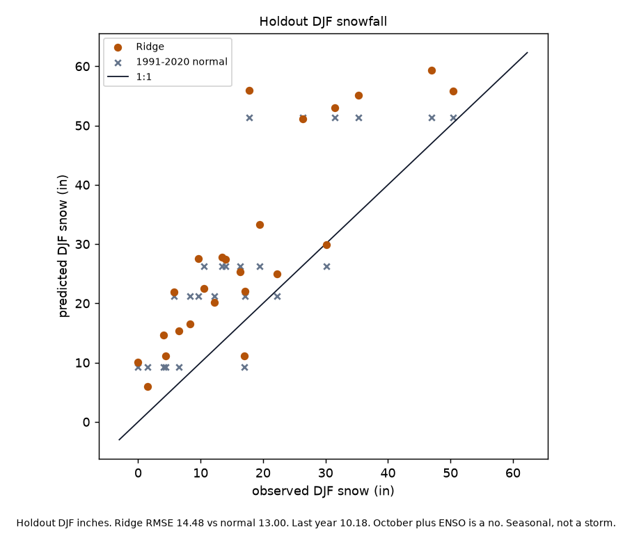
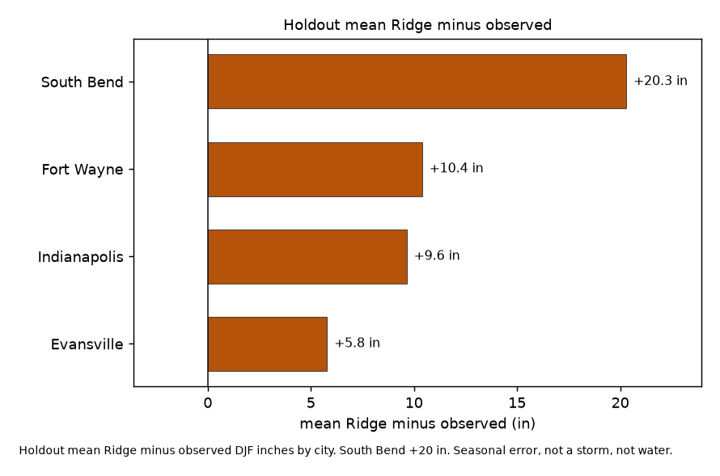

# Indiana DJF snowfall tercile vs 1991-2020 normal

Can October features plus ENSO beat the 1991-2020 DJF snowfall normal at held-out Indiana GHCND stations?

No. Holdout Ridge RMSE is 14.48 in against the 1991-2020 normal at 13.00 in. Last year's DJF total is 10.18 in. October plus ENSO does not beat the normal. Tercile hit rate is 0.21 vs always-near 0.17 vs last-year 0.58. No public winter page from this tree.

Amount science `ac36f0f`, JJA miss `1416da1`, and winter-lake miss `6b47f21` stay frozen. This tree does not read `p_sfha`, HAND, Nora Q, or NWM. GaugeCorr stays out.

Write-up: https://gist.github.com/martialsystems/b5f900aad37487bb8c0206a321c1ed5c  
Research index: https://gist.github.com/martialsystems/66b896b0a4a0b8cba2b478aef64312f3

Holdout n=24 station-winters (4 GHCND: South Bend, Fort Wayne, Indianapolis, Evansville). Train n=148 through DJF 2018-19. Confirmation DJF 2025-26 is out of train.



Figure 1. Holdout DJF inches. Ridge RMSE 14.48 vs normal 13.00. Last year 10.18. October plus ENSO is a no. Seasonal, not a storm.



Figure 2. Holdout mean Ridge minus observed DJF inches. Seasonal error, not a storm, not water.

## Live skill (held-out winters)

Locked from `logs/in_live/stage_c_report.json`. Inches. DJF 2019-20 through 2024-25.

| Model | RMSE (in) | MAE (in) | Tercile hit |
|-------|----------:|---------:|------------:|
| 1991-2020 normal | 13.00 | 10.54 | 0.17 |
| Last year | 10.18 | 7.83 | 0.58 |
| Ridge (October + ENSO) | 14.48 | 12.03 | 0.21 |

Always-near tercile hit is 0.17. Holdout is the product. October plus ENSO lost to a table of averages, and last winter's snow beat both. That is allowed to be the answer.

Confirmation DJF 2025-26 Ridge 4.25 vs normal 7.04 does not reopen a page. It does not set tercile cuts and cannot reverse the holdout. Four cores only. Fixture skill does not rescue live. Do not build the page.

## Stage 0

Synthetic stations with a planted ENSO-snow link. Fixture Ridge RMSE 2.72 vs normal 4.56. That does not rescue live skill.

```bash
python3.12 -m venv .venv
source .venv/bin/activate
pip install -r requirements.txt
PYTHONPATH=src:. python3 scripts/run_fixture.py logs/stage0_fixture
.venv/bin/python -m pytest tests -q
PYTHONPATH=src:. python3 scripts/run_live.py logs/in_live data/raw
```

Do not use stock `/usr/bin/python3 -m pytest`. Empty GHCND SNOW or missing 1991-2020 normals stops (`run_live.py` exit 2). Two figures max.

| File | Role |
|------|------|
| [METHODOLOGY.md](METHODOLOGY.md) | Locked contract |
| [AGENTS.md](AGENTS.md) | Agent rules |
| [CHECKLIST.md](CHECKLIST.md) | Operator list |
| `src/djsnow/` | GHCND SNOW, normals, ENSO, split, Ridge, figures |
| `snowforge/` | GraphForge pin |
